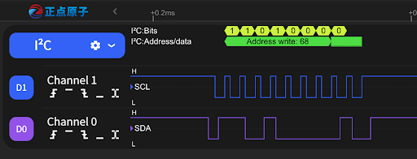

# 驱动调试
# SPI 驱动开发记录


# I2C 驱动开发记录

## 背景

在 xv6-k210 上移植 I2C 驱动，驱动 SSD1306 OLED 显示屏（128×64，I2C 地址 0x3C）。

K210 的 I2C 控制器是 Synopsys DW APB I2C IP，需要通过 FPIOA 将 I2C 信号映射到物理引脚。

**硬件连接：**
- SCL — 物理引脚 30 (I2C0_SCLK)
- SDA — 物理引脚 31 (I2C0_SDA)
- OLED 地址 — 0x3C (7-bit)

---

## 问题与解决

### 1. PLL 寄存器读回错误

**原因：** PLL 寄存器结构体使用了 `__attribute__((packed, aligned(4)))`，在 K210 上 bitfield 读回异常。

**解决：** 改为从 CPU 频率推算 I2C 时钟频率，硬编码分频系数：

```c
uint32_t v_i2c_freq = sysctl_clock_get_freq(SYSCTL_CLOCK_CPU) / 4;    // 时钟频率：计算 I2C 模块的实际输入时钟频率
uint16_t v_period_clk_cnt = v_i2c_freq / i2c_clk / 2;                 // 时钟周期：计算高低电平各需要维持多少个时钟周期，从而得到想要的 I2C 速率

**以下几点是可能的错误：** 调试过程中发现主机发送数据正常，但是从机没有回应ACK，但是后续整理又发现改完 CLK 之后 I2C 驱动就可以正常使用了


### 2. I2C_CON_SPEED 使用错误的计数值

**现象：** 使用 Fast Mode (`I2C_CON_SPEED(1)`) 时，控制器读取 `fs_scl_hcnt/fs_scl_lcnt` 寄存器，但这些寄存器位于 struct 的 `resv2[4]` 填充区域（未初始化），导致 SCL 时钟异常。

**解决：** 改用 Standard Speed (`I2C_CON_SPEED(0)`)，使用 `ss_scl_hcnt/ss_scl_lcnt` 寄存器。

### 3. enable_status 未轮询

**现象：** 硬件 I2C 工作不稳定，有时 ACK 有时无响应。

**原因：** DW APB I2C 控制器写入 `enable` 寄存器后，需要在另一个时钟域同步。直接写 `enable = 0` 可能被忽略，导致寄存器在控制器仍然启用时被修改。

**解决：** 增加 `enable_status` 轮询：

```c
i2c_adapter->enable = 0;
for (int i = 0; i < 1000; i++) {
    if ((i2c_adapter->enable_status & I2C_ENABLE_STATUS_IC_ENABLE) == 0)
        break;
}
// ...配置寄存器...
i2c_adapter->enable = I2C_ENABLE_ENABLE;
for (int i = 0; i < 1000; i++) {
    if ((i2c_adapter->enable_status & I2C_ENABLE_STATUS_IC_ENABLE) != 0)
        break;
}
```

### 4. TX_ABRT 后总线未空闲

**现象：** 地址扫描时大量 NACK 导致 TX_ABRT，返回后立即调用 `i2c_init` 可能冲突。

**原因：** `i2c_send_data` 检测到 TX_ABRT 后直接返回，未等待 `ACTIVITY=0`。

**解决：** 在 TX_ABRT 分支中增加等待总线空闲：

```c
if(i2c_adapter->tx_abrt_source != 0)
{
    while((i2c_adapter->status & I2C_STATUS_ACTIVITY) || !(i2c_adapter->status & I2C_STATUS_TFE))
        ;
    return 1;
}
```

### 5. 缺少 SDA 保持时间

**现象：** 数据字节偶发出错。

**原因：** DW APB I2C 默认 `sda_hold = 0`，即 SDA 在 SCL 跳变后无保持时间，从设备可能采样失败。

**解决：** 设置 SDA 保持时间 ~1.25µs：

```c
i2c_adapter->sda_hold = I2C_SDA_HOLD_TX(v_period_clk_cnt / 4) | I2C_SDA_HOLD_RX(v_period_clk_cnt / 8);
```

### 6. 缺少总线空闲时间

**现象：** 连续 I2C 事务间无停顿。

**原因：** 硬件控制器连续发送 STOP → START 之间没有足够的空闲时间，OLED 来不及处理。

**解决：** 在 `i2c_send_data` 结束时增加 ~5µs 延迟和清除 STOP_DET 标志：

```c
i2c_adapter->clr_stop_det = i2c_adapter->clr_stop_det;
for (volatile int i = 0; i < 200; i++);
```


## 关键文件

| 文件 | 说明 |
|------|------|
| `kernel/driver/i2c.c` | I2C 硬件驱动 + 软件模拟 I2C + OLED 测试 |
| `kernel/include/i2c.h` | I2C 寄存器定义 |
| `kernel/include/i2cdev.h` | 用户态 I2C 设备接口 |
| `kernel/devsw/i2cdev.c` | I2C 字符设备 (ioctl) |
| `kernel/include/oled_font.h` | 8×16 ASCII 字库 |
| `kernel/driver/fpioa.c` | FPIOA 引脚功能配置 |
| `kernel/driver/gpiohs.c` | GPIOHS 驱动（软件 I2C 使用） |

---

## 调试工具

- 串口输出（UARTHS）查看地址扫描结果和错误信息
- 逻辑分析仪抓取 I2C 波形
- 软件 I2C 与硬件 I2C 交替测试对比
